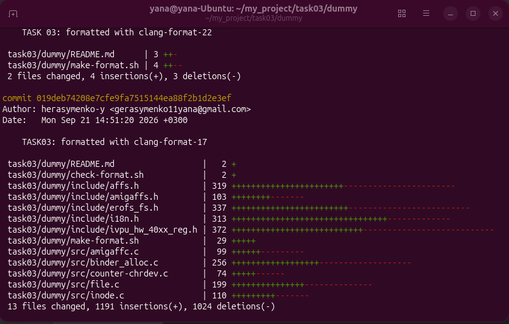
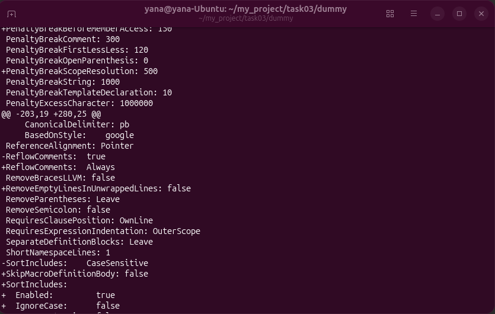
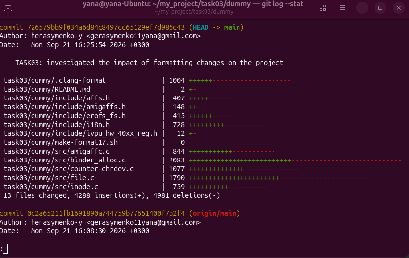
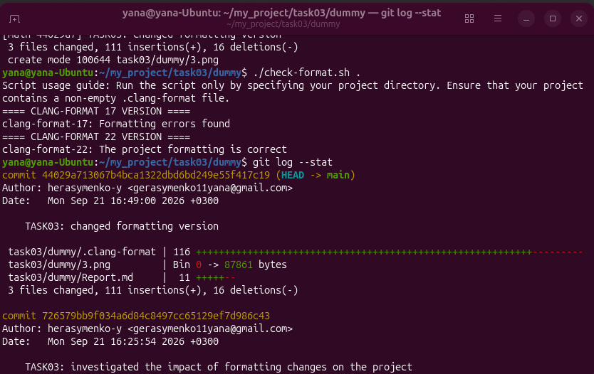

===Звіт===
1. При запуску скрипта check-format.sh обидві версії clang-format (і 17, і 22) видали повідомлення про помилку. Це підтверджує чутливість інструменту до прихованих символів (наприклад - різних форматів перенесення рядків), оскільки файли були скопійовані з хостової системи (Windows).

2. Проаналізувавши статистику git за допомогою команди git log --stat після форматування 17 та 22 версією можна зробити висновки: 
    а) форматування 17-ою версією призвело до масових змін у статистиці репозиторію. У багатьох файлах зафіксовано сотні змінених рядків
    б) під час подальшого форматування 22-ою версією не виявлено жодних змін у файлах коду. Це свідчить про те, що для такого набору правил розбіжностей між 17 та 22 версіями немає.
    

3. Було проаналізовано дві версії clang-format для стилю Chromium за допомогою команди "diff -u ...". Було виявлено зміни деяких правил у 22-й версії, а також появу нових. Окрім цього було виявлено відсутність у 22-й версії певних правил 17-ї. 

4. Після аналізу впливу форматування на проект за допомогою команди git log --stat виявлено: 
суттєві зміни форматування у проекті. Загалом змінено 13 файлів. Це свідчить про значний вплив зміни форматування на проект.

5. Під час дослідження впливу на проект різних версій форматування було виявлено:
    а) Застосування 22-ї версії форматування не викликало жодних змін у файлі з кодом проекту. Що свідчить про те, що нові правила охоплюють такі конструкції, які не використовуються у коді даного проекту.
    б) За допомогою тестування було виявлено, що використання конфігураційного файлу, згенерованого 22-ю версією не сумісне з старою 17-ю версією.
    
Загальний висновок : Проведені тести та аналіз доводить, що утиліта має зворотню сумісність, тобто нові версії коректно обробляють старі, але повна сумісність - відсутня.
    
