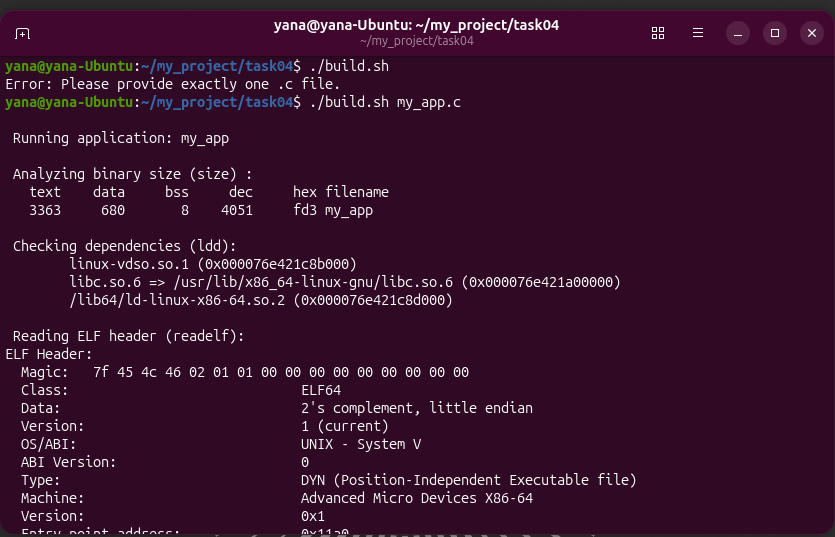
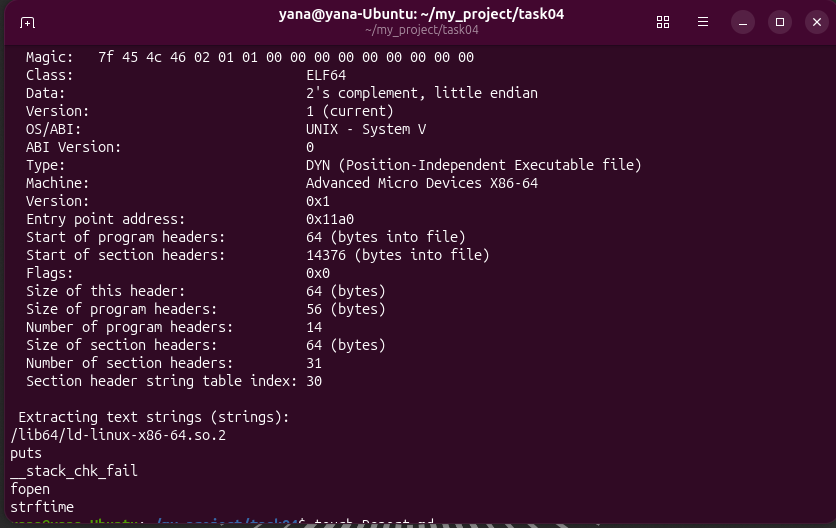

1. Було реалізовано програму на мові С, що виконує наступні функції :
- виводить у консоль інформацію про ОС (hostname, поточний час, операційну систему, апаратну платформу)
- приймає атрибут командного рядка (файл) : якщо такий файл уже існує - виводить необхідне попередження та записує всю інформацію в кінець такого файлу, якщо ні - створює та записує інформацію про ОС у файл.
2. Також було розроблено скрипт, за допомогою якого відбувається компіляція застосунку та його аналіз (size - розмір бінарного файлу, ldd - (перевірка залежностей - які файли знадобляться програмі для успішного запуску), readelf (для перевірки сумісності із залізом), strings (для пошуку рядків тексту)).

У ході перевірки застосунку та скрипта було виявлено :
- застосунок працює коректно
- аналіз за допомогою binutils пройшов успішно

