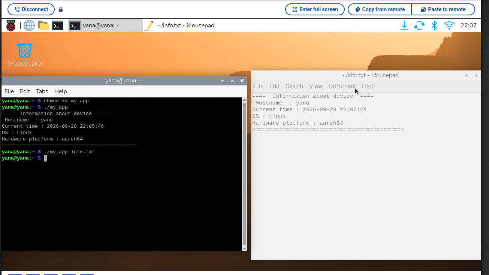
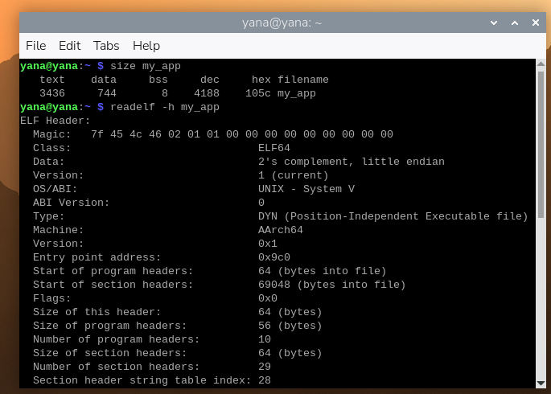
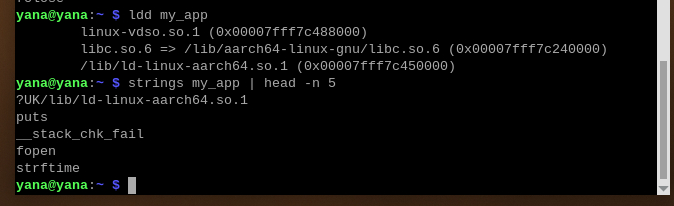
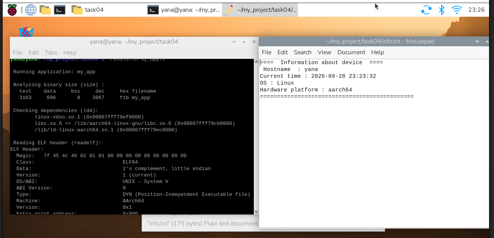
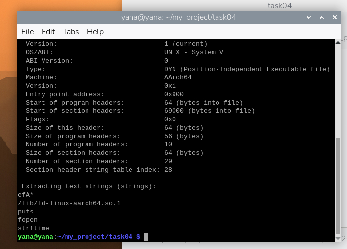

1. Було реалізовано програму на мові С, що виконує наступні функції :
- виводить у консоль інформацію про ОС (hostname, поточний час, операційну систему, апаратну платформу)
- приймає атрибут командного рядка (файл) : якщо такий файл уже існує - виводить необхідне попередження та записує всю інформацію в кінець такого файлу, якщо ні - створює та записує інформацію про ОС у файл.
2. Також було розроблено скрипт, за допомогою якого відбувається компіляція застосунку та його аналіз (size - розмір бінарного файлу, ldd - (перевірка залежностей - які файли знадобляться програмі для успішного запуску), readelf (для перевірки сумісності із залізом), strings (для пошуку рядків тексту)).

У ході перевірки застосунку та скрипта було виявлено :
- застосунок працює коректно
- аналіз за допомогою binutils пройшов успішно

3. У ході перенесення застосунку та його компіляції під таргет-систему на хост-системі було:
- змінено файл build.sh, оскільки рядок компіляції потребував інших параметрів. Окрім цього, всі дії з аналізу роботи програми у скрипті було вирішено закоментувати, оскільки скрипт на таргет-систему не був переданий у зв'язку з поставленим завданням.
- перевірено роботу застосунку, скомпільованого на хост-системі під таргет: застосунок показав коректну роботу як при наявності текстового файлу в аргументі командного рядка, так і без.
- проаналізовано роботу застосунку, у ході чого визначено: 
(size) - розмір застосунку на таргет-системі більший, ніж на хост-системі, що зумовлено компіляцією під дві різні апаратні платформи.
(readelf) - помічено зміни, так, наприклад у полі machine - різні назви, що свідчить про те, для якої саме архітектури скомпільована програма. Окрім цього, кількості заголовків програм та секцій також відрізняються, через особливості збірки програм для різних архітектур.
(ldd) - зміна необхідних шляхів до бібліотек для успішного запуску програми. 
(strings) - окрім шляхів до системних бібліотек для запуску, змін не виявлено.

4. Застосунок my_app.c було скомпільовано на таргет-системі: 
- скрипт build.sh було повернуто до початкового стану (розкоментовано команди, які були прибрані під час виконання попереднього завдання).
- аналізуючи результати, можна помітити, що розмір застосунку, зібраного на таргет-системі менше, ніж крос-скомпільованого та перенесеного з хост-системи. Це зумовлено використанням різних наборів інструментів для збірки.
